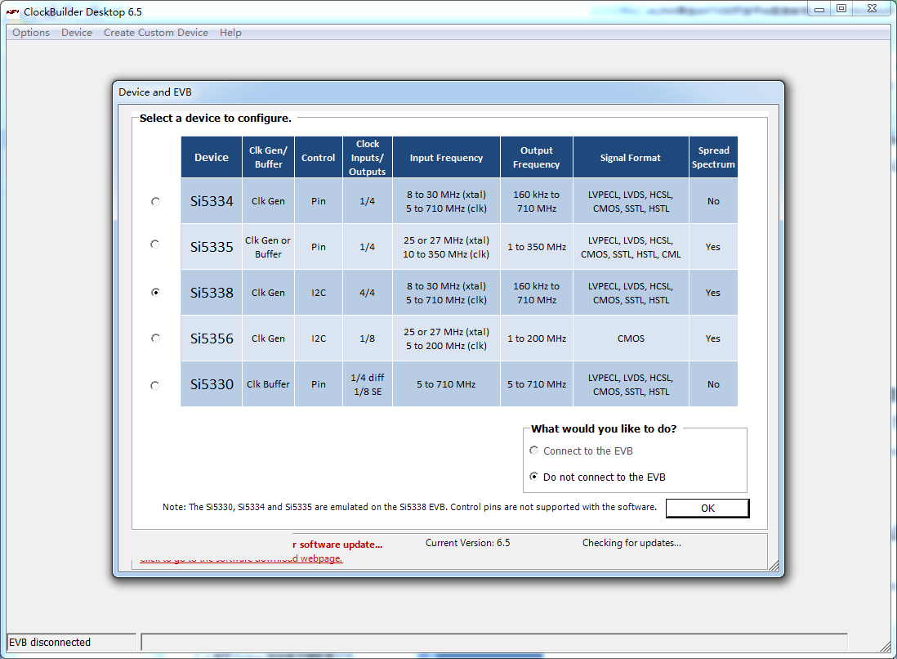

可编程时钟SI5338实验
===================================

**实验VIvado工程为“si5338_in3_pl_test”。**

开发板上有一个4通道差分输出可编程时钟芯片SI5338，可以为PL、收发器模块提供高质量的时钟，而且输出频率是可以动态编程的。

硬件介绍
--------

程序设计
--------

SI5338通过I2C来配置，配置寄存器的来源是通过软件“ClockBuilder
Desktop”，这个软件是Silicon
Laboratories公司提供。然后我们使用一个Python脚本把“ClockBuilder
Desktop”软件生成的C语言头文件“register_map.h”转换为一个rom初始化文件。“si5338.vhd”模块是用来配置SI5338，通过LED闪烁来判断si5338输出时钟是否正常。

ClockBuilder Desktop软件使用简介
--------------------------------

启动“ClockBuilder Desktop”软件，器件选择Si5338，选择“Do not connect to
the EVB”

    

    
输入配置“Input Configuration”选择“Single-ended on
IN3(5-350MHZ)”,输入频率“Enter the frequency”填写50，点击OK

.. image:: images/06_media/image3.png
    
配置4通道输出频率，CLK0为200MHZ，用于DDR3，CLK1和CLK3
100MHZ用于PCIe，CLK2为156.25MHZ，用于SFP光通信。

.. image:: images/06_media/image4.png
    
点击“Create Plan”后再点击“Apply Values to Register Map”

    
在“Output Drivers”标签页，设置CLK0A/B和CLK2A/B输出为1.8V
LVDS，CLK1A/B和CLK3A/B输出为1.8V HCSL，其他默认，点击“Apply Values to
Register Map”

.. image:: images/06_media/image6.png
    
在“Power”页，默认配置，点击“Apply to Device”

.. image:: images/06_media/image7.png
    
“Inc and Dec”页点击“Apply Values to Register Map”

    
“Spread Spectrum”页点击“Apply Values to Register Map”

.. image:: images/06_media/image9.png
    
点击“Options->Save C Code Header
File...”,保存一个“register_map.h”文件，这个文件后面会用到。

.. image:: images/06_media/image10.png
    
使用Python转换寄存器配置文件
----------------------------

芯驿电子提供了一个Python脚本，用于把“register_map.h”文件转换为一个mif文件，mif文件可以被VHDL读取并初始化一个ROM，用于配置SI5338的寄存器，安装好Python环境后可以直接点击“parse_register_map.py”，这个时候会生成一个“si5338.mif”文件。

.. image:: images/06_media/image11.png
    
Vivado工程建立
--------------

在前面的教程中详细介绍了如何建立一个工程，这里不再复述，可以直接参考芯驿电子提供的已经建立好的工程。

在工程的源代码目录可以看到“si5338.mif”文件，这个文件就是通过Python生成的ROM初始化文件。

    
下载调试
--------

生成bit文件以后，使用JTAG下载到开发板中，可以看到LED1、LED2、LED3都会同频闪烁，LED4常亮，按PL_KEY1复位LED1、LED2、LED3状态。

实验总结
--------

SI5338为FPGA提供了3路差分时钟，而是是可配置的，在后面的高速收发器GTX实验、PCIe实验中都会用到，本实验I2C同样使用PL来配置，后面的实验会使用PS来配置。

