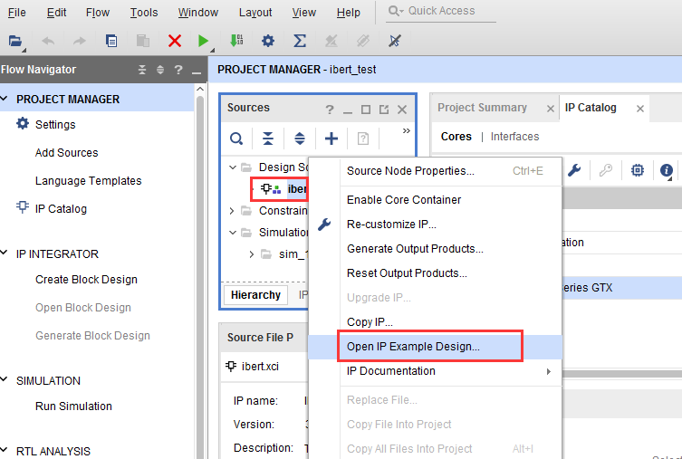
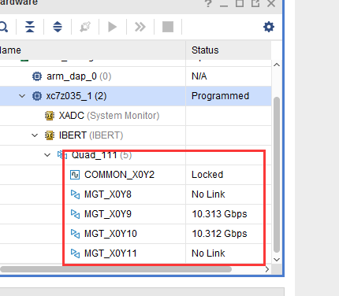

GTX收发器误码率测试IBERT实验
==================================================

**实验VIvado工程为“ibert_test”。**

Vidado软件为我们提供了强大的误码率测试器IBERT，不但可以测试误码率还能测试眼图，给我们使用高速收发器带来很大的便利，本实验做个抛砖引玉，简单介绍IBERT的使用。

硬件介绍
--------

使用IBERT测试误码率和眼图必须有个收发环通的硬件，开发板上有2个SFP光纤接口，本实验把2个光接口收发连接，形成2个收发环通链路。

Vivado工程建立
--------------

1) 新建一个工程名为“ibert_test”

.. image:: images/08_media/image1.png
    
2) 在“IP Catalog”中搜索“ibert”快速找到“IBERT 7 Series GTX”,双击

.. image:: images/08_media/image2.png
    
3) “Component
   Name”改为“ibert”，LineRate填写10.3125G，这是芯片支持的最大速率，Refclk（MHZ）选择156.250

.. image:: images/08_media/image3.png
    
4) 在“Protocol Selected”中选择“Custom 1/10.3125Gbps”,“Refclk
   Selection”选择“MGTREFCLK1 111”

    
5) 在“Clock Settings”页选择“Source”选择“QUAD111 1”

.. image:: images/08_media/image5.png
    
6) 生成IP core后等待一段时间后选择IP，右键“Open IP Example
   Design...”,为IP生成一个测试例程，很多IP都带有测试例程，包括前面讲解的ddr3控制器。

    
7) 选择测试例程的路径，点击“OK”

    
8) Vivado会自动生成一个工程并打开，这个例程可能需要我们修改才能正常使用，本实验中添加了SFP光发送使能，si5338配置程序，具体修改参考提供的工程。

.. image:: images/08_media/image8.png
    
下载调试
--------

1) 先使用插入光模块，然后使用光纤将2个光口对接，给开发板上电

2) 将修改后的例程工程编译生成bit文件，使用JTAG下载到开发板，然后刷新设备

.. image:: images/08_media/image9.png
    
3) 刷新完成以后的情况，可以看到有2个链路锁定，速度10.313Gbps。

    
4) 如果没有连接信息，可以右键点击“Auto-detect Links”

.. image:: images/08_media/image11.png
    
5) 点击“Serial I/O
   Links”,可以看到Errors都是0，如果不是0，可以点击“Reset”，重新开始测试。

.. image:: images/08_media/image12.png
    
6) 选择一个链路，右键“Create Scan...”

.. image:: images/08_media/image13.png
    
7) 默认配置出来的眼图，注意：使用不同的软件版本，测量眼图可能会有差异。

.. image:: images/08_media/image14.png
    
实验总结
--------

IBERT提供了强大的调试功能，本实验仅仅展示了部分功能，更详细的使用参考xilinx文档pg132。

