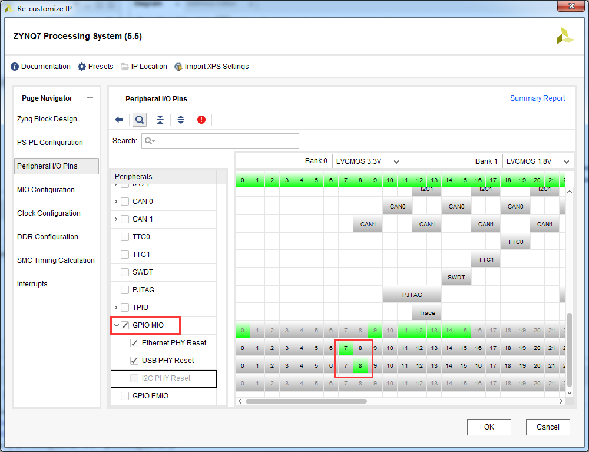
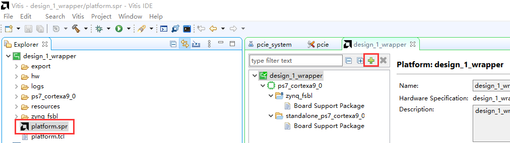
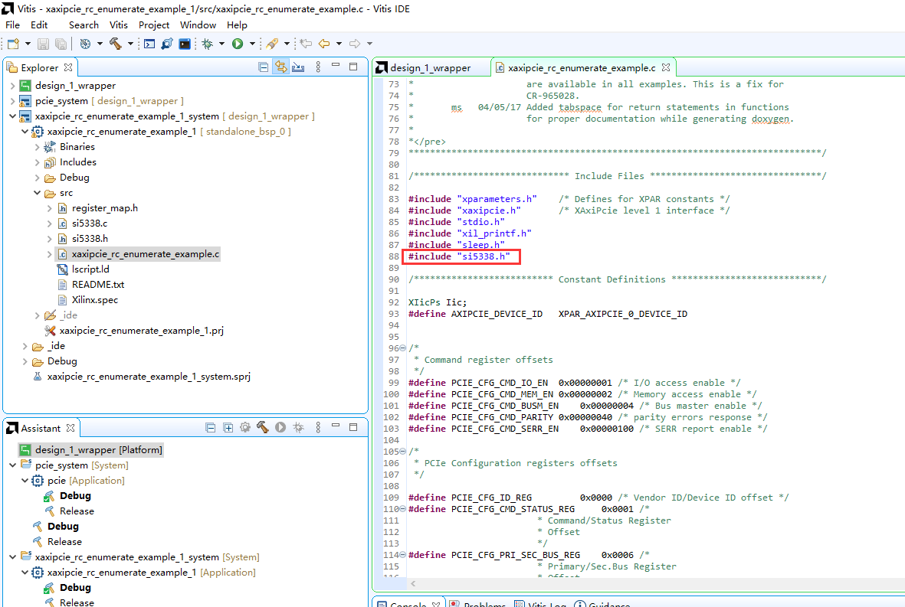

PCIe ROOT枚举测试
==================================

**实验VIvado工程为“pcie_root”。**

Vivado工程建立
--------------

创建新工程
~~~~~~~~~~

1) 新建一个工程名称为“pcie_root”,选择新建一个文件夹，点击“Next”

.. image:: images/17_media/image1.png
    
2) 工程类型选择“RTL Project”，同时选择“Do not specify sources at this
   time”，点击“Next”

.. image:: images/17_media/image2.png
    
3) “Parts”器件家族（Family）选择“Zynq-7000”，封装（Package）选择“ffg676”，然后选择“xc7z035ffg676-2”，点击“Next”

.. image:: images/17_media/image3.png
    
4) 点击“Finish”完成工程向导

创建block设计
~~~~~~~~~~~~~

1) 从Vivado流程导航窗口中点击“Create Block Design”

.. image:: images/17_media/image4.png
    
2) 给Block设计起名名字，这里保持“design_1”的默认名称，点击“OK”

.. image:: images/17_media/image5.png
    
3) 空白设计打开后，点击“Add IP”图标，在IP仓库中选择双击“ZYNQ7 Processing
   System”

.. image:: images/17_media/image6.png
    
4) ZYNQ PS block被添加到block设计中，点击“Run Block
   Automation”来配置目标硬件

.. image:: images/17_media/image7.png
    
5) 用默认设置，点击“OK”

.. image:: images/17_media/image8.png
    
6) 双击“processing_system7_0”配置ZYNQ PS

7) 在“PS-PL Configuration”选项卡中，使能HP Slave AXI接口“S AXI HP0
   interface”，HP端口可以让外部AXI Master接口高性能访问ZYNQ PS
   ddr3内存。

.. image:: images/17_media/image9.png
    
8) 在“Peripheral I/O Pins”选项中配置Bnak 1电平标准为“LVCMOS
   1.8V”，使能Quad SPI
   Flash，IO使用MIO1-MIO6，使能UART1，IO使用MIO12-MIO13

    
9) 使能Ethernet 0，IO使用MIO16-MIO27，使能USB0，IO使用MIO28-MIO39,

.. image:: images/17_media/image11.png
    
10) 使能Ethernet 0的MDIO，IO使用MIO52-MIO53，使能SD
    0，IO使用MIO40-MIO45，使能SD 1，IO使用MIO47-MIO51，使能I2C
    0，IO通过PL扩展，选择EMIO

    
11) SD 0的Card Detect选择MIO 10

.. image:: images/17_media/image13.png
    
12) 使能GPIO MIO，选择Ethernet PHY Reset为MIO7，USB PHY Reset为MIO8

    
13) 在DDR Configuration选择中选择Memory Part为“MT41J256M16 RE-125”

    
14) 在Interrupts选项中使能“Fabric
    Interrupts”，再使能IRQ_F2Q[15:0]，点击OK完成配置

.. image:: images/17_media/image16.png
    
添加AXI MM to PCIe bridge
~~~~~~~~~~~~~~~~~~~~~~~~~

1) 从IP 仓库添加 “AXI Memory Mapped to PCI Express” block 到设计中

    
2) 双击“axi_pcie_0”配置参数

3) 在“PCIE:Basics”配置选项中，端口类型选择“Root Port of PCI Express Root
   Complex”

    
4) 在“PCIE:Link Config”选项中，“Lane Width”选择X4，“Link speed”选择5
   GT/s

.. image:: images/17_media/image19.png
    
5) 在 “PCIE:ID” 选项中，“Class Code”填写 0x060400.
   这是为了以后在Linux下能正确的使用驱动程序。

.. image:: images/17_media/image20.png
    
6) 在“PCIE:BARS”项中, 设置BAR 0 类型为 “Memory” ，大小为 1
   Gigabytes，其他参数都保持默认，点击“OK”

    
7) 添加一个“Utility Buffer”到 block设计

.. image:: images/17_media/image22.png
    
8) 双击“util_ds_buf_0”，选择“C Buf
   Type”为“IBUFDSGTE”，这种类似是收发器专用参考差分时钟BUFFER，开发板上来自SI5338输出，频率为100Mhz

    
9) 连接 utility buffer 的输出“IBUF_OUT” 到 AXI-PCIe 模块的“REFCLK”输入。

.. image:: images/17_media/image24.png
    
10) 添加一个“Constant”模块到设计中

.. image:: images/17_media/image25.png
    
11) 双击“Constant”配置参数Const Val修改“0”

    
12) 把xlconstant_0输出连接到axi_pcie_0的输入INTX_MSI_Request

.. image:: images/17_media/image27.png
    
添加复位模块
~~~~~~~~~~~~

设计中有2个时钟，都是来自AXI-PCIe
bridge模块的输出，分别为“axi_aclk_out”、“axi_ctl_aclk_out”，一个用于PCIe数据传输，一个用于模块的寄存器控制，所以要添加2个复位模块。

1) 添加“Processor System Reset”到设计中，默认名称为“proc_sys_reset_0”

.. image:: images/17_media/image28.png
    
2) 把“axi_pcie_0”模块的输出“axi_ctl_aclk_out”连接到“proc_sys_reset_0”模块的输入“slowest_sync_clk”,
   把“axi_pcie_0”模块的输出“mmcm_lock”连接到“proc_sys_reset_0”模块的输入“dcm_locked”,把模块“processing_system7_0”的输出“FCLK_RESET0_N”连接到模块“proc_sys_reset_0”的输入“ext_reset_in”。

.. image:: images/17_media/image29.png
    
3) 添加“Processor System Reset”到设计中，默认名称为“proc_sys_reset_1”

4) 把“axi_pcie_0”模块的输出“axi_aclk_out”连接到“proc_sys_reset_1”模块的输入“slowest_sync_clk”,
   把“axi_pcie_0”模块的输出“mmcm_lock”连接到“proc_sys_reset_1”模块的输入“dcm_locked”,把模块“processing_system7_0”的输出“FCLK_RESET0_N”连接到模块“proc_sys_reset_1”的输入“ext_reset_in”。

    
添加DMA模块
~~~~~~~~~~~

1) 添加一个“AXI Central Direct Memory Access”到设计中

    
2) 双击“axi_cdma_0”打开配置窗口，“Write/Read Data
   Width”选择128，不要勾选“Enable Scatter Gather”

    
连接中断
~~~~~~~~

1) 添加一个“Concat”到设计中

.. image:: images/17_media/image33.png
    
2) 连接axi_pcie_0模块的中断到xlconcat_0模块的In0端口，连接axi_cdma_0模块的中断到xlconcat_0模块的In1端口，连接xlconcat_0模式的输出dout到ZYNQ
   PS处理器IRQ_F2P端口。

.. image:: images/17_media/image34.png
    
添加AXI互联模块
~~~~~~~~~~~~~~~

1) 添加一个“AXI
   Interconnect”模块到设计中，默认名称为“axi_interconnect_0”

    
2) 双击“axi_interconnect_0”，配置参数修改为2个Slave端口，1个Master端口

    
3) 连接“axi_interconnect_0”模块的M00_AXI端口到ZYNQ
   PS处理器的S_AXI_HP0端口

    
4) 添加一个“AXI
   Interconnect”模块到设计中，默认名称为“axi_interconnect_1”

5) 双击“axi_interconnect_1”，配置参数修改为2个Slave端口，3个Master端口

          
6) 连接 “axi_interconnect_1”模块的“M00_AXI” 端口到AXI-PCIe模块的
   “S_AXI”端口，连接 “axi_interconnect_1”模块的“M01_AXI”
   端口到AXI-PCIe模块的 “S_AXI_CTL”端口，连接
   “axi_interconnect_1”模块的“M02_AXI” 端口到CDMA模块的 “S_AXI_LITE”端口

    
7) 添加一个“AXI
   Interconnect”模块到设计中，默认名称为“axi_interconnect_2”

8) 连接 “axi_interconnect_2”模块的“M00_AXI”端口到
   “axi_interconnect_0”模块的“S01_AXI” 端口，连接
   “axi_interconnect_2”模块的“M01_AXI”端口到
   “axi_interconnect_1”模块的“S01_AXI” 端口，连接
   “axi_interconnect_2”模块的“S00_AXI”端口到 “axi_cdma_0”模块的“M_AXI”
   端口

    
连接时钟
~~~~~~~~

1) 连接 “axi_aclk_out”时钟到Zynq PS的输入 “M_AXI_GP0_ACLK” 和
   “S_AXI_HP0_ACLK”

.. image:: images/17_media/image41.png
    
2) 连接 “axi_aclk_out”时钟到“axi_cdma_0”的输入 “m_axi_aclk” 和
   “s_axi_lite_aclk”

    
3) 连接“axi_interconnect_0”所有时钟到“axi_aclk_out”

    
4) 连接“axi_interconnect_1”除了“M01_ACLK”的所有时钟到“axi_aclk_out”

.. image:: images/17_media/image44.png
    
5) 连接“axi_interconnect_2”所有时钟到“axi_aclk_out”

.. image:: images/17_media/image45.png
    
6) 连接“axi_interconnect_1”的时钟“M01_ACLK”到“axi_ctl_aclk_out”

    
连接复位信号
~~~~~~~~~~~~

1) 连接复位模块“proc_sys_reset_0”的输出“peripheral_aresetn”到AXI互联模块“axi_interconnect_1”的复位输入“M01_ARESETN”。

.. image:: images/17_media/image47.png
    
2) 连接复位模块“proc_sys_reset_1”的输出“peripheral_aresetn”到AXI互联模块“axi_interconnect_1”的其他复位输入，连接到“axi_interconnect_0”、“axi_interconnect_2”的全部复位输入。

    
其他连接
~~~~~~~~

1) 连接“axi_pcie_0”的“M_AXI”到“axi_interconnect_0”的“S00_AXI”

.. image:: images/17_media/image49.png
    
2) 连接ZYNQ处理器的“M_AXI_GP0”到“axi_interconnect_1”的“S00_AXI”

.. image:: images/17_media/image50.png
    
端口设置
~~~~~~~~

1) util_ds_buf_0差分时钟输入，右键“Make External”

.. image:: images/17_media/image51.png
    
.. image:: images/17_media/image52.png
    
2) 修改名称为“pcie_ref”

    
3) 同样扩展出“axi_pcie_0”的“pcie_7x_mgt”端口，修改名称

    
4) 将IIC_0端口引出，端口名为“si5338_iic”，用于配置SI5338

    
5) 选择复位模块“proc_sys_reset_0”的输出“peripheral_aresetn”，右键然后选择“Create
   Port...”

.. image:: images/17_media/image56.png
    
6) 端口名称填写“pcie_rstn”

    
地址分配
~~~~~~~~

7) 在“Address Editor”窗口点击自动分配图标

.. image:: images/17_media/image58.png
    
8) 出现一个警告

.. image:: images/17_media/image59.png
    
9) 把axi_pcie_0的BAR0地址范围改为256M后，重新点击自动分配

    
10) 重新分配以后的地址，然后保存block设计

.. image:: images/17_media/image61.png
    
创建HDL封装
~~~~~~~~~~~

1) 在“Sources”选项卡中选择Block设计右键，然后“Create HDL wrapper”

.. image:: images/17_media/image62.png
    
2) 点击“OK”

.. image:: images/17_media/image63.png
    
添加xdc约束
~~~~~~~~~~~

1) 在约束选项下点击“Add Sources”，在弹出的窗口选择“Add or create
   constraints”

.. image:: images/17_media/image64.png
    
2) 点击“Create”，名称填写pcie，然后点击“Finish”

.. image:: images/17_media/image65.png
    
3) 修改xdc文件，文件内容不再给出，在开发板给的工程里可以找到（pcie_root/pcie_root.srcs/constrs_1/new/pcie.xdc）。

    
关键步骤
~~~~~~~~

pcie模块会自动带上管脚约束信息，但是和我们的硬件设计是不相符的，这个时候需要我们把自带的xdc文件添加不使用属性。

1) 在模块设计“design_1_i”右键选择“Generate Output Products...”

    
2) 在“IP
   Sources”选项卡中搜索xdc文件，axi_pcie_X0Y0.xdc就是我们要找的文件

    
3) 选择这个文件然后右键“Disable File”

.. image:: images/17_media/image69.png
    
4) 编译生成bit文件

.. image:: images/17_media/image70.png
    
Vitis下载调试
-------------

1) 导出硬件

.. image:: images/17_media/image71.png
    
2) 选择包含bit文件

.. image:: images/17_media/image72.png
    
3) 运行Vitis

    
4) 新建一个BSP

    
5) 保持默认的工程名，“Board Support Package OS”选择“standalone”

.. image:: images/17_media/image75.png
    
6) 保持默认配置，选择“OK”

    
7) 点击“Board Support Package”/Modify BSP
   Setting,在“axi_pcie_0”这一行选择“Import Examples”，导入一个例程

    
8) 选择“xaxipcie_rc_enumerate_example”

    
9) 复制文件用于si5338的配置，相关文件可以到开发板例程的Vitis目录找到

.. image:: images/17_media/image79.png
    
10) 在Vitis的工程目录选择src目录，右键“Paste”把上面复制的三个文件粘贴到src目录

.. image:: images/17_media/image80.png
    
11) 修改“xaxipcie_rc_enumerate_example.c”文件，添加si5338的相关配置，先添加头文件

    
12) 在PcieInitRootComplex函数中添加si5338的配置,保存编译。

    
13) 打开运行配置

.. image:: images/17_media/image83.png
    
14) 选择“Single Application Debug”双击

    
15) 在PCIe
    插槽插入PCIe设备，例如SSD，网卡等，连接串口调试终端，选择复位整个系统并编程FPGA，开发板上电后点击“Run”

    
16) 串口终端软件输入了一些信息，包括Si5338配置，PCIe设备的一些信息

    
实验总结
--------

本实验建立了PCIe
Root的Vivado工程，然后通过Vitis裸机程序测试了PCIe枚举设备的功能，为我们PCIe
Root应用打下基础，后面教程我们会通过Linux来使用PCIe Root功能。
 

